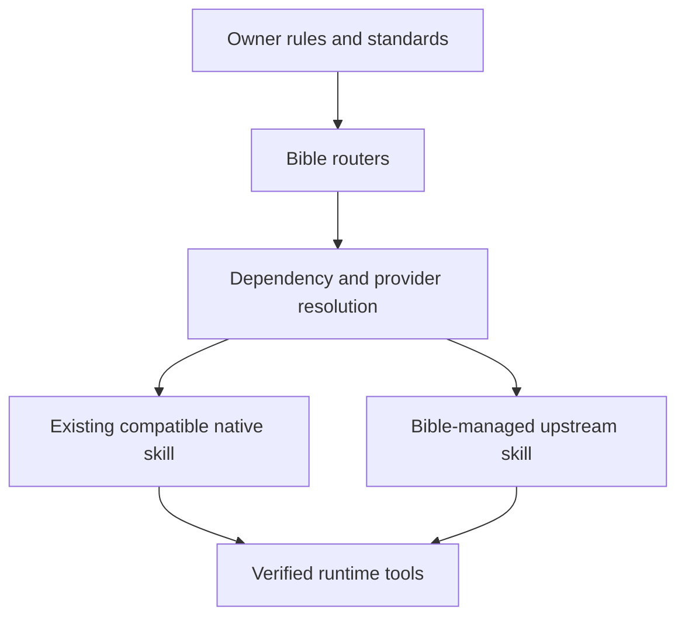

# Bible as a Policy and Routing Layer

Date: 2026-10-03.
Status: approved architecture with an implemented author dependency lifecycle
and absorbed-workflow migration. Implementation in this checkout
does not imply production installation or current-session exposure.

## Owner's Goal

Bible keeps the owner's engineering rules, standards, routers, and integration
contracts. Author-maintained skills and tools remain identifiable upstream
dependencies that can be installed when missing and updated independently.
Bible must preserve the author's procedure rather than replace it with a
summary that loses its update path.

Success means that a selected workflow has one discoverable provider, a known
source and version, a complete dependency set, and a route from the owner's
policy to the actual skill. Updating Bible must not overwrite an author's skill
or a user's local edits. Updating an upstream dependency must not replace the
owner's rules.

## Pre-Pilot Baseline

These were the source-checkout facts before this pilot, including existing
uncommitted changes; they are not claims about an installed host:

- `skills/registry.yml` owns local membership, grouping, and order.
  `scripts/registry.py` expects a local `skills/<name>/SKILL.md` for each entry.
- `scripts/installer_core.py` manages the Bible snapshot, active projections,
  hashes, backups, and rollback. Its current manifest format describes Bible
  ownership, not independently managed upstream packages.
- `scripts/be.py` implements `be update` as a Bible package update.
  `be add skill` copies an external skill into two external directories without
  recording source/ref/commit/content hashes for subsequent updates.
- `config/tools.json` and `scripts/tool_catalog.py` already provide tool
  provenance, explicit selection, version checks, and separate setup steps.
  They do not connect skill requirements to tool selection.
- `skills/workflow-router/references/routes.md` already prefers exposed
  product skills over copying their procedures into Bible.
- The June CLI design proposed external provenance and a lockfile. Those
  proposals are not evidence of implemented dependency lifecycle commands.

## Delivered Migration and Boundaries

`config/upstream-skills.json` pins 30 complete trees: nine Pocock skills, all 15
Superpowers 6.4.2 skills, the original Karpathy-inspired guidelines and three
[business UI specialists](../../business-ui-profile.md), property-based testing
and context compression. See [testing/context authors](../../quality-context-authors.md).
Registry
v3 separates author membership from owner groups and declares required originals
for each owner profile, while preserving v1/v2 parsing. Standard profiles require
20 originals; Pocock/continuation groups remain opt-in and fast remains compact.
`be skills list|plan|status|ensure|check|update|rollback|route` provides dependency
selection, exact existing-tree reuse, missing-only installation, reviewed updates,
tracking checks and separate transaction recovery. See the
[operating guide](../../upstream-skills.md) for actual command behavior.

The Pocock selection includes `grill-me`, `grilling`, `grill-with-docs`, `domain-modeling`,
`writing-for-agents`, `pr`, `retro` and `to-questionnaire`. Their required skill
edges and referenced files are retained. Default profile installation ensures
its author dependencies. Verified legacy rewrites transfer ownership; thin
aliases retain owner policy and load the complete original. The
[62-skill migration ledger](../../absorbed-skills-migration.md) records each
decision and its provenance confidence. `implement-spec` and further unreviewed
author catalogs remain deferred.

The default Codex skill root is inventoried recursively, including `external/`;
other native installation roots require explicit `--skill-root` options. Provider
reuse requires an exact canonical tree digest, not an inferred compatible version.
The CLI does not read private host configuration or prove native invocation.
Routing retains unverified exposure and reports pending tool/setup requirements.

## Approaches Considered

| Approach | Update behavior | Trade-off |
| --- | --- | --- |
| Copy and rewrite upstream procedures | Requires manual reconciliation | Retains today's loss of author updates |
| Require all skills to be installed externally | Native manager handles updates | Bible cannot ensure missing dependencies or reproduce a profile |
| Keep policy local and resolve upstream providers | Reuse verified existing installs; manage missing dependencies | Needs provenance, ownership, and host adapters |

Choose the third approach. Prefer an existing compatible host-native provider;
otherwise install the selected, reviewed dependency under Bible ownership.

## Responsibilities

| Kind | Bible owns | Update owner |
| --- | --- | --- |
| Owned | Personal policies, standards, routers, unique workflows | Bible |
| Upstream | Selection, provenance, reviewed revision, dependency contract | Author or native package manager |
| Adapter | Host invocation, policy boundaries, naming compatibility | Bible |
| Fork | Explicitly divergent source with origin and patch history | Named maintainer; manual reconciliation |

An adapter contains only integration information and the conditions for loading
the real skill. It must not paraphrase the author's workflow. A genuine local
specialist remains owned when its procedure is independently maintained and
useful; not every leaf skill needs an upstream replacement.

Author files, relative references, assets, and executable modes remain intact.
Adapters and policy overlays are separate files. Any host-only metadata
projection is explicitly recorded, regenerated, and compared against the
immutable source; it is not an unlabelled edit of the upstream skill.

## Catalog and Local State

Keep `skills/registry.yml` as the source of membership, grouping, and order.
Its implemented v3 schema keeps local groups separate from `upstream` membership
and declares `upstream_required` profile dependencies. The schema-v1
`config/upstream-skills.json` provenance catalog owns source
and dependency records; its skill identities must match registry membership.
`config/tools.json` remains the tool catalog and retains its existing contracts.

The portable dependency records contain:

- Stable dependency identity and author skill name.
- Credential-free public GitHub repository URL, source path, license identity
  and license digest. A source can require sibling provider directories;
  Superpowers uses this layout contract to preserve cross-tree payload paths.
- Reviewed full commit, complete skill-tree digest, and a separate
  upstream tracking channel. A mutable branch is discovery input, never a lock.
- Required skill edges, required/optional tool IDs, explicit-invocation policy
  and workflow-intent bindings. Each complete selected tree retains its own
  referenced files and assets.

Additional sources may require version ranges, supported-host constraints,
package-manager adapters and declared configuration effects. Those are future
schema work, not fields accepted by the current catalog. The 30 selected
skill records declare no package-manager tool dependencies; runtime prerequisites
still need verification against the author instructions at invocation.

Machine-local state records the resolved provider, reviewed revision, hashes,
ownership and rollback identity. Local modifications are checked against current
files; session exposure remains unverified rather than being recorded as active.
Managed upstream artifacts, caches, backups, and installation locks live outside
tracked distribution files. Project-local generated state stays under the
untracked `.engineering-bible/` boundary. Paths, credentials, endpoints, and
host inventories never enter the public catalog.

## Install Missing Dependencies

During an explicitly selected `be skills ensure` or reviewed `update`:

1. Resolve the complete declared dependency graph. Reject cycles, conflicting
   identities, invalid reviewed pins and unsupported required tools before writing.
2. Inventory the Codex skill root recursively and any explicit extra roots.
   Reuse exact matching provider trees; do not infer availability from one
   package manager's inventory or private host configuration.
3. Report unknown provenance, local edits, or an incompatible existing provider
   as a conflict. Do not adopt, overwrite, disable, or uninstall it silently.
4. Stage missing reviewed dependencies at immutable revisions. Validate source,
   digest, license, paths and frontmatter. Preserve the referenced author files
   without executing bundled code or setup instructions.
5. Preserve the whole required upstream skill tree. Importing text does not run
   setup skills, bundled scripts, hooks, or package initialization code.
6. Project one discoverable provider per workflow and install the owner's routes
   and adapters separately. Verify files and report host exposure independently.

The user's selected installation can authorize installing its disclosed missing
dependencies; a second confirmation is not inherently required. New effects
outside that scope, authentication, private services, and destructive migration
remain distinct. Native package managers that install an entire pack must report
that full scope; do not pretend they install just one selected skill.

Ensure installs disclosed missing required tools through the tool catalog;
optional tools need an explicit selection. Unresolved required setup or runtime
capabilities keep the dependent route unavailable with a concrete reason.
Installing a tool is separate from configuring credentials, enabling a hook or
service, and proving runtime capability. Preserve `fast` and existing profile
selection semantics. Normal task routing does not trigger network installation
or update checks on every turn.

## Routing Contract

Routes select a workflow intent and resolve it to an available, compatible
provider. The result identifies the owner policy, actual upstream skill,
dependency version, adapter if any, and required runtime capabilities.
User-named skills and current-session exposure retain priority.

Preserve narrow leaf selection and the continuation fast path. Load the actual
upstream instructions only when needed. A filesystem installation is not proof
that the current session can invoke it; report a pending reload when applicable.
Host invocations must use real host capabilities rather than assume a universal
`Skill` tool exists.

Personal safety and engineering rules apply through the owner's existing
instruction hierarchy. When upstream behavior conflicts with them, the adapter
must identify the conflict or the provider must be marked incompatible. Do not
silently drop steps and claim to have run the author's workflow.

An owned alternative is usable only as a separately named, explicit route; it
must not counterfeit a missing upstream provider. Old names may become thin
aliases after migration, with an explained target and one effective workflow.

## Follow and Apply Author Updates

Upstream tracking and installed revisions are separate concerns:

1. The pilot's read-only `check` compares the public tracking commit with the
   reviewed pin and reports revision status. Review changed author files,
   dependencies, invocation rules and effects separately.
2. Preview the proposed revision and owner-policy compatibility. New hooks, scripts,
   licenses, dependency changes, and configuration writes need fresh review.
3. Stage and validate the complete affected dependency set. Freeze the reviewed
   commit/digest so a moved tag cannot change the applied content.
4. Apply a reviewed update to Bible-owned artifacts with locking, backup, and
   recovery. Local edits remain a conflict; upstream files are not merged blindly.
5. Recheck routes and exposure, record actual outcomes, and retain rollback data.

The pilot validates backup integrity before restoration and preserves local edits
arriving during a transaction. A recovery conflict may leave its journal intact;
deliberate file/state reconciliation is required before another write operation.
Do not treat a failed recovery or a remaining journal as a successful rollback.

Native-managed providers update through their own manager. Bible checks their
compatibility and exposure without taking ownership. Package-manager tool
updates may not be reversible or atomic with skill updates; report partial
results and the real remaining recovery steps.

Keep Bible package updates and upstream dependency updates separately selectable.
`be update` retains its package semantics; `be skills update` applies only reviewed
catalog pins. Any future combined operation must show its full plan. The pilot
creates no background monitor or automatic author update.

## Migration Status

| Slice | Status |
| --- | --- |
| Inventory all local workflows and prove origin | Complete 62-skill ledger; explicit adaptations, compatible replacements and unknown origins distinguished |
| Compatible registry parsing, provenance and dependency resolution | Implemented for reviewed GitHub source trees |
| Missing install, exact provider reuse, check/update and transaction recovery | Implemented; final review fixes and integration gates are recorded in the plan |
| Pocock interview/domain/writing pilot plus PR, retrospective and questionnaire | Eight skill trees in four opt-in groups; live host exposure remains unverified |
| Thin aliases, local workflow replacement and further author packs | Implemented for Superpowers, Karpathy-inspired guidelines and native plugin adapters; host invocation remains separate |
| Required tool planning/install connection | Implemented through the existing catalog; setup and activation remain separate |

During migration, remove obsolete owned projections only when their
manifest hashes still match.
Preserve unmanaged files, user modifications, existing packs, explicit skill
names, and installed prompt profiles. A migrated alias and an upstream skill
must not both carry complete competing workflow bodies.

## Required Evidence for Implementation

Meaningful regression coverage must demonstrate:

- Existing provider reuse, missing-only installation, dependency closure, and
  repeated synchronization without duplicates or extra mutations.
- Unknown provider identity, incompatible versions, cycles, collisions, local
  edits, unsafe paths, moved refs, and hash failures stop before activation.
- Author file fidelity, relative references/assets, invocation policies, and
  adapters survive updates without altering owner rules.
- Checks are read-only; staging failure preserves the active install; interrupted
  operations and partial tool updates have honest recovery results.
- Old registry/manifest/profile inputs work or receive an explicit migration;
  owned-hash removal preserves custom files; aliases resolve deterministically.
- Installed files, CLI startup, and live host exposure remain separate evidence.

Run the smallest checks per slice, then `make validate-bootstrap`, `make validate`,
and `make validate-release` for installer/release integration. Record exact
`PASS`, `FAIL`, and `SKIP` outcomes in the
[implementation plan](../plans/2026-10-03-upstream-skill-lifecycle.md). Final review
and gate results must not be inferred from a checklist or installation log;
native session exposure and functional author-workflow execution remain separate
from repository validation.

## Candidate Queue

See [Upstream skill additions](../../upstream-skills-backlog.md) for the delivered
pilot records and deferred candidates. Selection covers the eight reviewed
trees, not an entire third-party pack, native activation or production installation.
